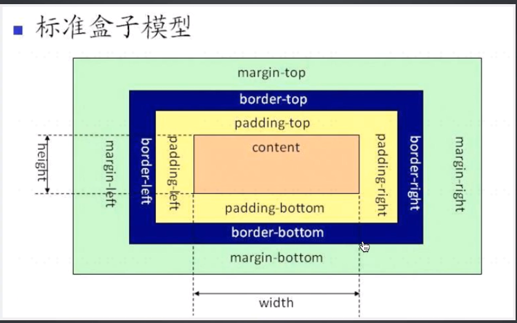

# 盒子模型

盒子模型相关可参考：MDN

##### 标准盒子模型和IE盒子模型的区别

最大的区别是在width的计算上的不同

标准盒子模型：width = concent

IE盒子模型：width = concent+padding+border

##### box-sizing属性

box-sizing属性允许以某种方式定义某些元素，以适应指定区域。

box-sizing属性类似于ie盒模型，它会把内边距和边框包含在width内。我们设置一个固定宽度的盒子，但当给它设置padding、border之后，它的真正宽度就会改变。这时box-sizing就派上用途了。它会自动调整内容的宽度，保证盒子的真正宽度还是我们设置的宽度。
