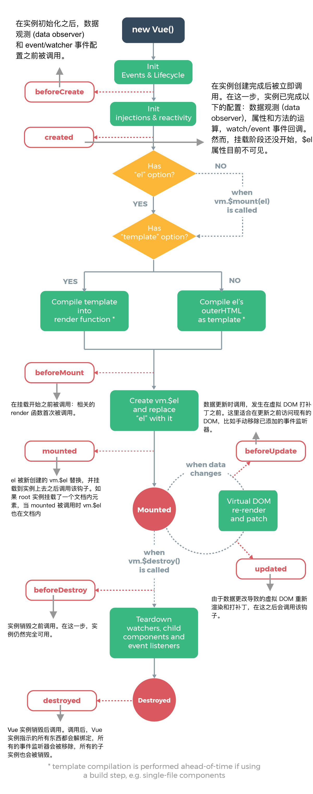

# Vue实例

## 创建Vue实例

每个Vue应用最基础的就是通过Vue函数创建一个Vue.js实例。最简单的例子：

```js
var vm = new Vue({
  // options
})
```

我们知道，new关键字可以实例话一个构造函数或者class。而这里Vue就是class。我们在使用new关键字实例话对象时。我们可以传入一个**选项对象**（⚠️选项参数在官方文档中加粗）。

我们看一下都有哪些**选项参数**：data、props、propsData、computed、watcher、methods。Vue类在内部根据这个**选项参数**进行的初始化。

## 数据与方法

Vue.js一个核心思想就是**数据驱动**。所谓数据驱动，是指视图是由数据驱动生成的，我们对视图的修改，不会直接操作DOM，而是通过修改数据。当Vue实例被创建后，data对象中的所有属性都加入到Vue的响应式系统中。如果这些属性发生变化，视图将会产生“响应”，即匹配更新为新的值。

Vue实例还暴露了一些有用的实例属性与方法。它们都有前缀 $，以便与用户定义的属性区分开来。

我们列举几个：$data表示可以访问原始数据对象。$props表示当前组件接收到的props对象等等。

## 声明周期

每个 Vue 实例在被创建时都要经过一系列的初始化过程——例如，需要设置数据监听、编译模板、将实例挂载到 DOM 并在数据变化时更新 DOM 等。同时在这个过程中也会运行一些叫做生命周期钩子的函数，这给了用户在不同阶段添加自己的代码的机会。

在我们实际项目开发过程中，会非常频繁地和 Vue 组件的生命周期打交道。所以我们应该明白每一个生命周期函数它的调用时机。




## 总结

Vue.js实例就是对选项参数、声明周期函数的初始化，以及将数据添加到响应式系统中。其中生命周期和数据响应式是Vue的重点。我们以后会在单独一章去分别剖析。